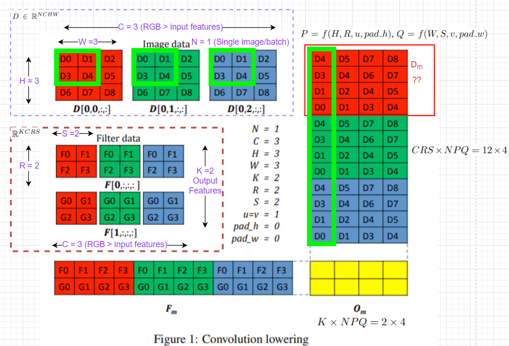

# Tiling

## Code
```python
matC[i*t:(i+1)*t, j*t:(j+1)*t] += tmul(matA[i*t:(i+1)*t, k*t:(k+1)*t], matB[k*t:(k+1)*t, j*t:(j+1)*t], t)
```

# Convolution Lowering

## Definition
- Transform 3d matrix into 2d matrix

  - Filter : (# Kernel, # Channel, Kernel Height, Kernel Width) &rarr; (# Kernel, # Channel * Kernel Height * Kernel Width)
    - translate single kernel to one row(vector)
  - Input : (# Channel, Input Height, Input Width) &rarr; (Kernel Height * Kernel Width, # Channel * Kernel Height * Kernel Width)
    - translate single filtered area to one column(vector)

## Code
```python
def weight_lowering():
    lowered_weights = weights.reshape(o_chn, i_chn*kernel_size*kernel_size)
    return lowered_weights

def inputs_lowering():
    # padding
    pad, _ = padding
    inputs_padded = torch.zeros(bs, i_chn, res+pad*2, res+pad*2)
    inputs_padded[..., pad:res+pad, pad:res+pad] = inputs

    lowered_inputs = torch.zeros(kernel_size*kernel_size, i_chn, bs, res*res)
    for i in range(kernel_size):
        for j in range(kernel_size):
            lowered_inputs[i*kernel_size+j] = inputs_padded[..., i:res+i, j:res+j].transpose(0, 1).reshape(i_chn, bs, -1)
                
    lowered_inputs = lowered_inputs.transpose(0, 1)
    lowered_inputs = lowered_inputs.reshape(i_chn*kernel_size*kernel_size, bs*res*res)        
    return lowered_inputs
    
def outputs_lifting(outputs):
    outputs = outputs.reshape(o_chn, bs, res, res);      
    outputs = outputs.transpose(0, 1)
    return outputs
```

# Quantization

## Definition
- Quantize floating point number to integer
- $

## Code
```python
# STE
class roundpass(torch.autograd.Function):
    @staticmethod
    def forward(ctx, input):
        ## TODO ##
        ## Define output w.r.t. input
        ctx.save_for_backward(input)
        output = torch.round(input=input)
        return output

    @staticmethod
    def backward(ctx, grad_output):
        ## TODO ##
        ## Define grad_input w.r.t. grad_output
        return grad_output

# Quantization
class Quantizer(nn.Module):
    def __init__(self, bits=8, always_pos=False):
        super(Quantizer, self).__init__()
        
        self.first = True
        self.num_steps = 2 ** bits
        self.always_pos = always_pos
     
        self.Qp = 2**(bits-1) - 1
        self.Qn = - 2**(bits-1) 

    def forward(self, x):
        if self.first:
          self.alpha = x.abs().max().detach()
          self.first = False

        step_size = 2 * self.alpha / self.num_steps   
        if self.always_pos:
            off = self.alpha
        else:
            off = 0 

        # Quantization
        q_x = torch.clamp(roundpass((x - off)/step_size), self.Qn, self.Qp) * step_size + off
        return q_x
```